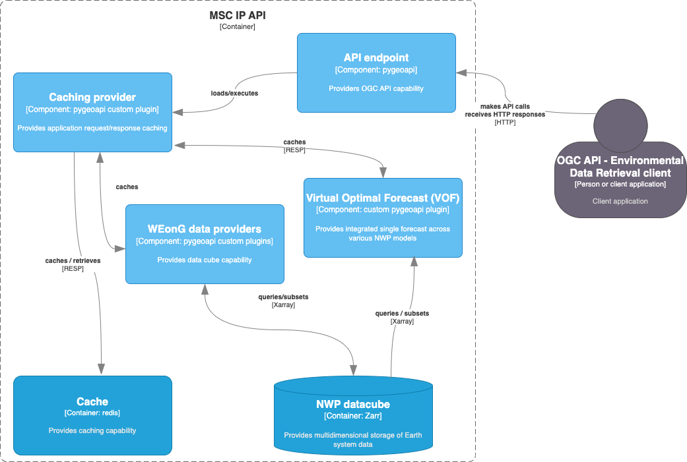

# RPN pygeoapi

RPN pygeoapi

<a href="docs/architecture/c4.component.png"></a>

## Deployments

- default: http://localhost:5089
- DEV: TODO

## Setup
```bash
# build image
make build

# run API
make up

# stop API
make down

# inspect logs
make logs
```

## Sample requests

- Landing page: http://localhost:5089
- OpenAPI document (SwaggerUI): http://localhost:5089/openapi
- API collections: http://localhost:5089/openapi

## Code Conventions

* [PEP8](https://www.python.org/dev/peps/pep-0008)

## Bugs and Issues

All bugs, enhancements and issues are managed on [GitHub](https://github.com/ECCC-ASTD-MRD/rpn-pygeoapi/issues)

## Contact

* [Philippe Carphin](https://github.com/PhilippeCarphin)
* [Tom Kralidis](https://github.com/tomkralidis)
* Ibrahim Boudaouara
